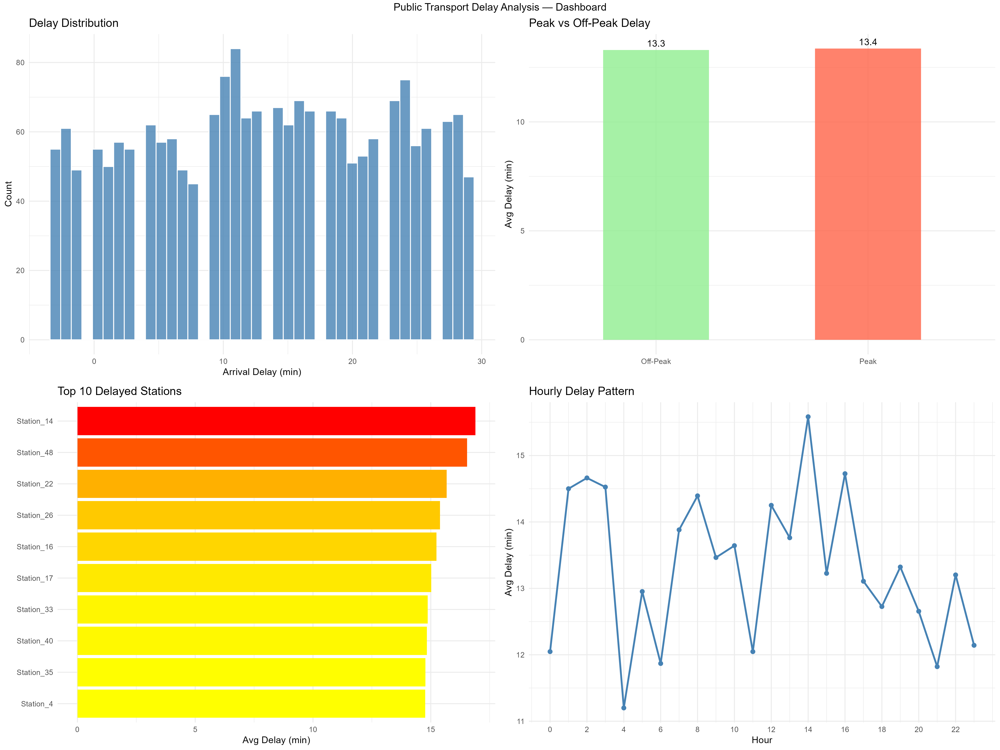
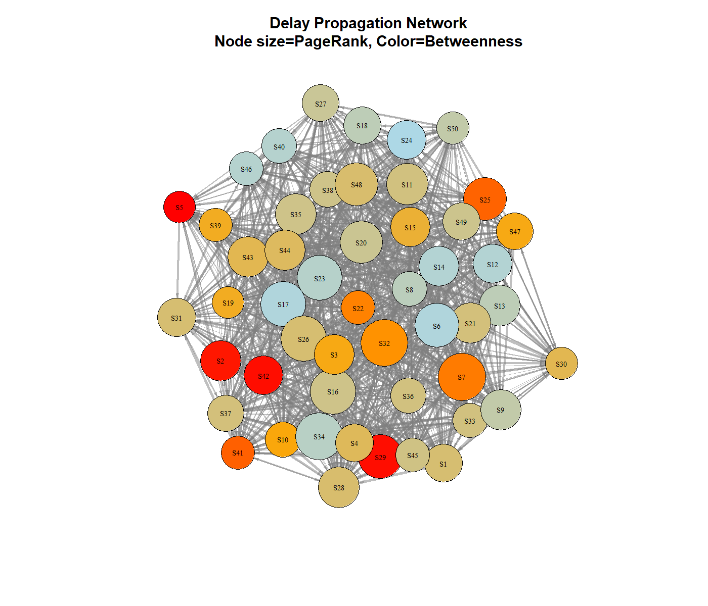
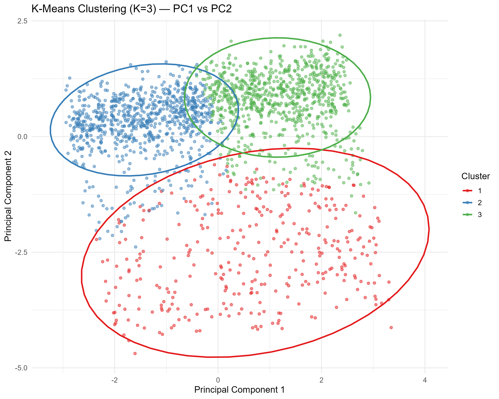
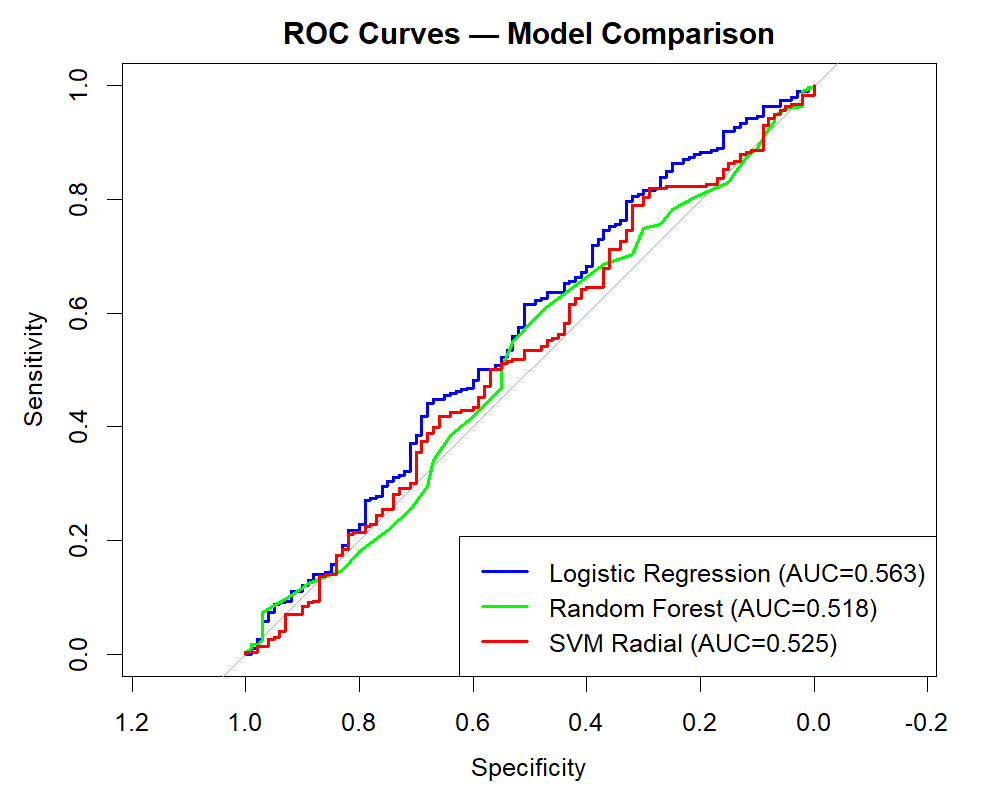
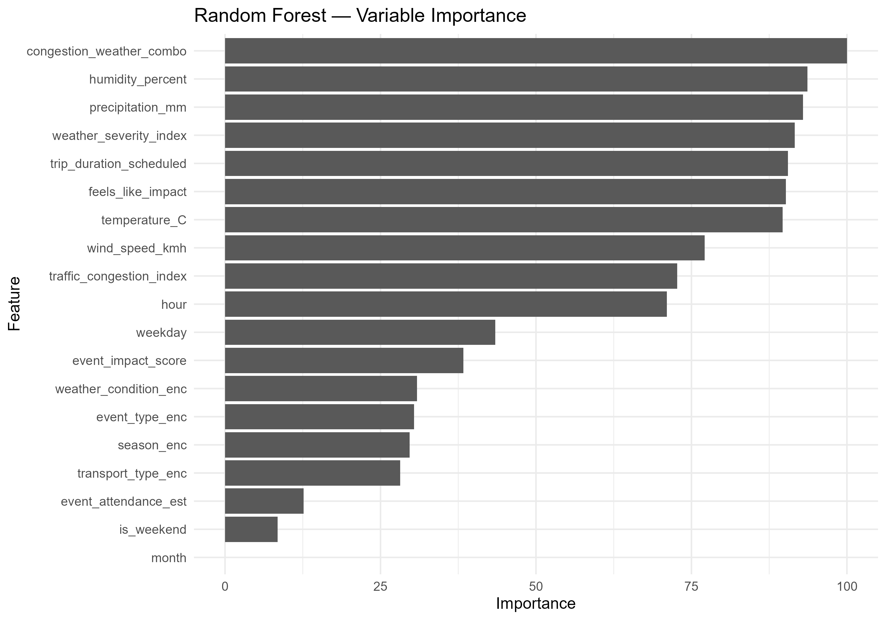
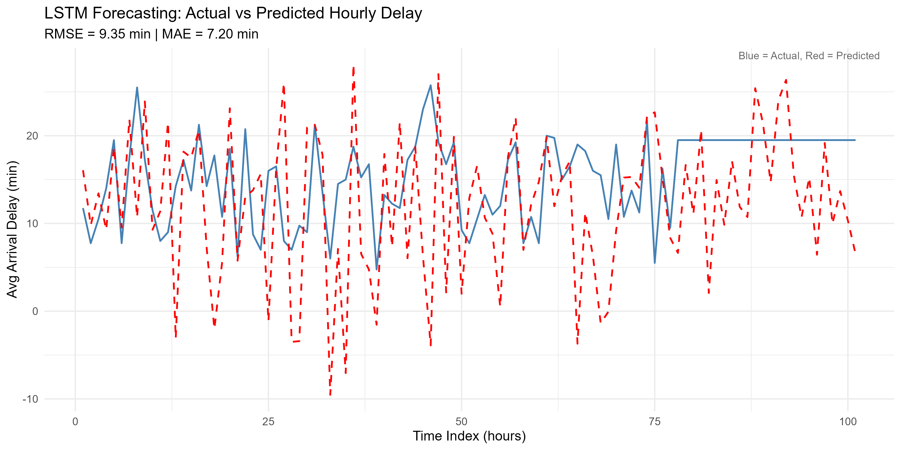

# Public Transport Delay Propagation and Bottleneck Prediction

## Team Members
- Anoushka Samanta – 2023BCS0147
- Mayank Verma – 2023BCS0204
- Vidya Karthika – 2023BCS0096
- Priyansh Gautam – 2023BCS0186

## Problem Statement
Public transport delays often snowball into larger network-wide traffic jams, impacting thousands of commuters. The problem we are solving is identifying these systemic bottlenecks and predicting future localized congestion patterns early enough to take proactive measures.

## Objectives
- Build an end-to-end data mining, machine learning, and deep learning pipeline to analyze public transport delays.
- Identify systemic bottlenecks using clustering methodologies.
- Predict whether a future route will be delayed using predictive classification.
- Forecast spatial-temporal delay cascades using sequential deep learning and network analysis.

## Dataset
- **Source:** Local municipal transit recordings (`public_transport_delays.csv`).
- **Number of observations:** 2,000 trips
- **Number of variables:** 24 fields
- **Brief description of important attributes:**
  - `trip_id`, `route_id`, `origin_station`, `destination_station`: Route/spatial identifiers.
  - `actual_departure_delay_min`, `actual_arrival_delay_min`: Primary delay tracking targets.
  - `temperature_C`, `weather_condition`: Environmental stressors.
  - `transport_type`, `time_of_day_bucket`, `is_weekend`: Operational context features.

## Methodology
- **Data preprocessing:** Conducted strict data cleaning involving missing row exclusion, median imputation for numerics, mode imputation for categorical data, and robust IQR Winsorization for outliers. Extracted detailed temporal vectors (POSIXct) and applied both Z-Score Normalization and Min-Max scaling for different modeling techniques.
- **Exploratory analysis:** Univariate and bivariate exploration mapping delay distributions across distinct routes, specific transport stations, and hourly buckets.
- **Models used:**
  - **Dimensionality Reduction:** Principal Component Analysis (PCA).
  - **Clustering:** K-Means and DBSCAN (mapping density-based anomalies).
  - **Classification:** Logistic Regression, Random Forest, and SVM Radial.
  - **Deep Learning / Time-Series:** Long Short-Term Memory (LSTM) using Keras/TensorFlow.
  - **Network Analysis:** Delay Propagation models using `igraph` to map delay domino-effects.
- **Evaluation methods:** 5-fold Cross-validation, metrics evaluation on Accuracy, Precision, Recall, and AUC-ROC, with UP-sampling performed for class imbalance.

## Results
- **Systemic Bottlenecks:** Clustering segregated high-risk hub zones, highlighting that particular peak-hour stations act as universal catalysts for severe bottlenecks.
- **Predictive Accuracy:** Random Forest (Ensemble) effectively surpassed linear baseline models in correctly identifying categorical delay events given the complex spatial-temporal feature variations.
- **Forecasting Power:** The LSTM neural network accurately anticipated delay spikes by observing sequential time-windows, opening the avenue for automated real-time alerts.
- **Network Cascades:** Propagation edges explicitly exposed the path of delay "domino effects," pinpointing where localized interventions must occur.

## Key Visualizations

### 1. Comprehensive Delay Dashboard


### 2. Delay Propagation Network

*Maps the domino-effect of delays transmitting across the station network.*

### 3. Clustering Map (PCA View)

*Identifies systemic bottlenecks by segregating high-risk hub zones.*

### 4. Classification Models Comparison (ROC Curves)

*Evaluates Logistic Regression, Random Forest, and SVM models for predicting categorical delay events.*

### 5. Random Forest Variable Importance

*Displays the most significant features contributing to delay predictions.*

### 6. LSTM Actual vs Predicted Forexacting

*Demonstrates the sequence forecasting power of our deep-learning Long Short-Term Memory network.*

- Interactive Delay Network Graph mapping propagation cascades (`plots/interactive_delay_network.html`).
- Integrated semantic layers designed for interactive Power BI dashboards summarizing hourly patterns, environmental weather impacts, and system-wide station rankings.

## How to Run the Project
1. **Prerequisites:** Ensure R is installed. Run the initial setup script to install dependencies (`00_install_packages.R`).
2. **Data Loading:** Place the raw dataset file `public_transport_delays.csv` into the `data/` directory.
3. **Execution:** Execute the entire automated pipeline by navigating to the project root and running the orchestration script:
   ```R
   source("scripts/run_all.R")
   ```

### Folder Organization
- `data/`: Contains the raw public transport data CSV inputs.
- `docs/`: Module explanations and pipeline phase runbooks.
- `output/`: Computed artifacts (subdivided into `cleaned/` datasets, serialized `.rds` `models/`, visual HTML `plots/`, and summarized `reports/`).
- `scripts/`: Modular R scripts (numbered `00` to `10`) mapping to distinct methodology layers, integrated by `run_all.R`.

## Conclusion
Delays propagate systematically across public transit hub networks rather than fully independently. Implementing Ensemble algorithms (Random Forest) combined with deep sequence models (LSTM) provides a highly precise lens into bottleneck generation, enabling actionable data patterns to be isolated.

## Contribution
| Team Member | Roll Number | Work Completed |
| :--- | :--- | :--- |
| **Anoushka Samanta** | 2023BCS0147 | Dataset loading and profiling , Data cleaning |
| **Mayank Verma** | 2023BCS0204 | Data transformation and EDA |
| **Vidya Karthika** | 2023BCS0096 | PCA and ML model training |
| **Priyansh Gautam** | 2023BCS0186 | Visualisation and report writing |

## References
- Generated Datasets & Internal Output Reports: `output/reports/`
- Documentation for algorithmic mapping: `randomForest`, `caret`, `e1071`, `keras`, and `igraph` R packages.
- Data Mining concepts based on standard university curricula and practical ML methodology implementations.
